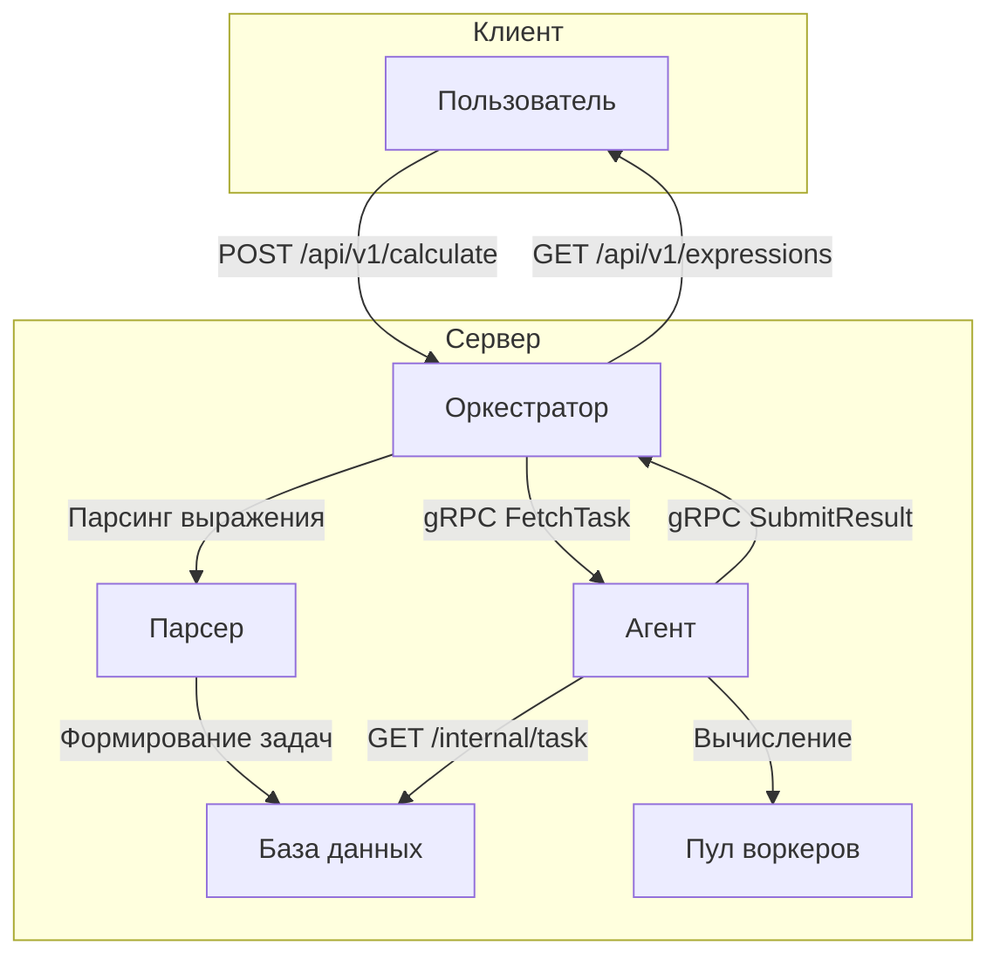

# Calculator3.0
---

Распределённая многопользовательская система для вычисления арифметических выражений с использованием параллельных вычислений, а также со сохранением в базе данных. Проект состоит из двух основных компонентов – **Оркестратора** и **Агентов**, взаимодействующих через HTTP/REST API и gRPC.

---

## Содержание

- [Описание проекта](#описание-проекта)
- [Возможности](#возможности)
- [Почему Calculator3.0?](#почему-calculator30)
- [Архитектура системы](#архитектура-системы)
- [Установка и запуск](#установка-и-запуск)
  - [Требования](#требования)
  - [Клонирование репозитория](#клонирование-репозитория)
  - [Запуск с Docker Compose](#запуск-с-помощью-docker-compose)
  - [Локальный запуск](#локальный-запуск)
- [Конфигурация](#конфигурация)
- [Документация API](#документация-api)
- [Примеры использования](#примеры-использования)
- [Тестирование](#тестирование)
- [Внесение вклада](#внесение-вклада)
- [Подсказки и лайфхаки](#подсказки-и-лайфхаки)
- [Известные проблемы и FAQ](#известные-проблемы-и-faq)
- [Технологии и зависимости](#технологии-и-зависимости)
- [Дорожная карта](#дорожная-карта)
- [Контакты](#контакты)
- [Лицензия](#лицензия)

---

## Описание проекта

**Web Calculator** — масштабируемый веб-сервис на Go для асинхронного и многопользовательского вычисления арифметических выражений. Пользователь отправляет выражение через REST API оркестратора, который преобразует его в задачи, делегирует агентам через gRPC и собирает результаты.

> 💡 Каждая операция (сложение, вычитание, умножение, деление) выполняется с имитацией задержки, заданной через переменные окружения, что демонстрирует преимущества распределённых вычислений.

### Проект был создан как задание для обучения программированию на Go и демонстрирует принципы распределённых вычислений, управления задачами и интеграции компонентов через REST API, gRPC, а также использование базы данных.
---

## Возможности

* **JWT-аутентификация**: регистрация и логин через `POST /api/v1/register` и `POST /api/v1/login`.
* **Параллельная обработка**: оркестратор разбивает выражение и рассылает подзадачи агентам.
* **REST API**: удобный HTTP-интерфейс для отправки выражений и получения истории.
* **gRPC-связь**: надёжный и быстрый обмен данными между службой и агентами.
* **SQLite-персистентность**: хранение пользователей и задач в локальной базе.
* **Веб-интерфейс** (опционально): НЕТУ ПОКА ЧТО.
* **Тесты**: unit и интеграционные тесты, чтобы не скончаться со стыдом при проверке.

---
## Почему Calculator3.0?
- Демонстрация принципов распределённых вычислений и обработки задач в Go.
- Подходит для образовательных проектов, нагрузочного тестирования и микросервисной архитектуры.
- Лёгкая интеграция с gRPC, REST и SQLite.
---
## Архитектура системы

### Компоненты

1. **Оркестратор**
   - Принимает запросы от пользователя.
   - Преобразует арифметические выражения в набор задач.
   - Управляет очередью задач и собирает результаты вычислений.

2. **Агент**
   - Получает задачи от оркестратора.
   - Выполняет операции (с имитацией задержек) с последующей отправкой результатов обратно.
3. **База данных (SQLite)**

   * Хранит пользователей, задания и историю вычислений
4. **Веб-интерфейс (опционально)**

  * не готово еще

### Схема взаимодействия



*Примечание:* В первоначальном варианте был представлен и простой текстовый вариант работы, но приведённая выше схема (на основе Mermaid) считается более наглядной и удобной для понимания. 
Поэтому **возможны** различия между схемой и проектом

---
## Конфигурация

Перед запуском установите необходимые переменные окружения. В объединённом варианте объединены сведения из обоих README:

| Переменная         | Описание                                      |
|--------------------|-----------------------------------------------|
| `PORT`             | Порт оркестратора (по умолчанию 8080)         |
| `COMPUTING_POWER`  | Количество воркеров                           |
| `TIME_ADDITION_MS` | Задержка для операции сложения (мс)           |
| `TIME_SUBTRACTION_MS` | Задержка для операции вычитания (мс)       |
| `TIME_MULTIPLICATION_MS` | Задержка для операции умножения (мс)    |
| `TIME_DIVISION_MS` | Задержка для операции деления (мс)            |
## *Примечание:* jwt secret храниться прямо в коде по пути Internal/User/user.go, про безопасность в ТЗ не было. 
### Пример для Windows (Git bash) и macOS/Linux (bash)

```bash
export PORT=8080
export COMPUTING_POWER=5
export TIME_ADDITION_MS=200
export TIME_SUBTRACTION_MS=150
export TIME_MULTIPLICATION_MS=100
export TIME_DIVISION_MS=250
```

### Пример для Windows (PowerShell)

```powershell
$env:PORT = 8080
$env:COMPUTING_POWER = 5
$env:TIME_ADDITION_MS = 200
$env:TIME_SUBTRACTION_MS = 150
$env:TIME_MULTIPLICATION_MS = 100
$env:TIME_DIVISION_MS = 250
```

---

## Установка и запуск

### Требования

- **Go** версии 1.20+
- **Docker** и **Docker Compose** (для контейнеризации)
- Git
- Любой HTTP-клиент (curl, Postman, Git bash и т.д.)
> [!CAUTION]
> При использовании powershell или cmd могут возникуть проблемы с работой cURL , так как в них нельзя использовать одинарные кавычки. Можете воспользоваться аналогами , такими как : [Postman](https://www.postman.com/) или [WSL](https://en.wikipedia.org/wiki/Windows_Subsystem_for_Linux) или [GitBash](https://git-scm.com/)
### Клонирование репозитория

```bash
git clone https://github.com/sharkwithmilk/Calculator3.0
cd GoCalculator3.0
```

### Запуск с помощью Docker Compose

В корневой директории проекта выполните команду:

```bash
docker-compose up --build
```
После этого запустятся:
- **Оркестратор** – доступен по адресу: [http://localhost:8080](http://localhost:8080)
- **API** – по адресу: [http://localhost:8080/api/v1](http://localhost:8080/api/v1)
- **Агент(ы)** – работают параллельно, если их несколько
  
### Локальный запуск

1. **Установка зависимостей:**

   ```bash
   go mod download
   ```
   ```bash
   go mod tidy
   ```

2. **Запуск оркестратора:**

   ```bash
   go run ./cmd/orchestrator/main.go
   ```

3. **Запуск агента (в отдельном терминале):**

   ```bash
   go run ./cmd/agent/main.go
   ```

После этого запустятся:
- **Оркестратор** – доступен по адресу: [http://localhost:8080](http://localhost:8080)
- **API** – по адресу: [http://localhost:8080/api/v1](http://localhost:8080/api/v1)
- **Агент(ы)** – работают параллельно, если их несколько
---


## Документация API

### Публичные эндпоинты (для пользователей)

Все запросы, кроме `/register` и `/login`, требуют заголовок:

```
Authorization: Bearer <JWT>
```

#### Регистрация

```bash
curl -X POST http://localhost:8080/api/v1/register \
  -H "Content-Type: application/json" \
  -d '{"login":"user1","password":"pass123"}'
```

* **200 OK** – регистрация успешна
* **409 Conflict** – пользователь существует
* **422** – неверные данные

#### Вход

```bash
curl -X POST http://localhost:8080/api/v1/login \
  -H "Content-Type: application/json" \
  -d '{"login":"user1","password":"pass123"}'
```

* **200 OK** – возвращает `{ "token": "..." }`
* **401 Unauthorized** – неверные данные

#### Отправка выражения

```bash
curl -X POST http://localhost:8080/api/v1/calculate \
  -H "Content-Type: application/json" \
  -H "Authorization: Bearer $TOKEN" \
  -d '{"expression":"(3+5)*2/4"}'
```

* **201 Created** – `{ "id": 123 }`
* **422** – неверный формат
* **500** – внутренняя ошибка

#### Получение списка выражений

```bash
curl -X GET http://localhost:8080/api/v1/expressions \
  -H "Authorization: Bearer $TOKEN"
```

* **200 OK** – `{ "expressions": [...] }`

#### Получение результата по ID

```bash
curl -X GET http://localhost:8080/api/v1/expressions/123 \
  -H "Authorization: Bearer $TOKEN"
```

* **200 OK** – `{ "expression": {...} }`
* **404** – не найдено

## Веб-интерфейс(не работает пока что"(" )

Для удобства взаимодействия с системой доступен веб-интерфейс, который можно открыть по адресу:

```
/Front/index.html
```

Интерфейс позволяет:
- Регистрироваться
- Авторизовываться
- Вводить арифметические выражения через форму
- Просматривать историю вычислений
- Отслеживать статус выполнения задач в реальном времени

---
## Примеры использования

### Отправка арифметического выражения

```bash
curl -X POST http://localhost:8080/api/v1/calculate \
     -H "Content-Type: application/json" \
     -d '{"expression": "2 + 2 * 2"}'
```

### Получение списка выражений

```bash
curl http://localhost:8080/api/v1/expressions
```

### Получение результата конкретного выражения

```bash
curl http://localhost:8080/api/v1/expressions/12345
```

### Работа агента: получение задачи и отправка результата

1. **Получение задачи:**

   ```bash
   curl http://localhost:8080/internal/task
   ```

2. **Отправка результата:**

   ```bash
   curl -X POST http://localhost:8080/internal/task \
        -H "Content-Type: application/json" \
        -d '{"id": "7", "result": 7}'
   ```

---

## Тестирование 

- **Тестирование:** Проект покрыт автоматизированными тестами(интеграционными и также модульными). Запустить тесты можно командой:
  ```bash
  go test ./Tests/...
  ```
Покрытие: **unit** и **интеграционные** тесты.
Попробуй, и если что-то не так — говори! 🚀 [тг](https://t.me/Shi_v_borshi).
---

## Внесение вклада

- Создавайте issues и пулл-реквесты с подробным описанием ваших замечаний.
- Форк → Ветка `feature/...` → PR + описание + тесты  
- Пожалуйста, соблюдайте Go Code Style и добавляйте юнит-тесты.
---

## Подсказки и лайфхаки

* Если выражение виснет — проверьте логи от агента и оркестратора.
* Для быстрой проверки можно использовать Postman или `curl`.
* Не забывайте обновлять `COMPUTING_POWER` при увеличении числа агентов.

---


## Известные проблемы и FAQ

- **Некорректные выражения:** Убедитесь, что выражение содержит допустимые символы и правильно расставлены скобки.
- **Ошибка 422 при запросе:** Проверьте, что JSON-запрос сформирован корректно и содержит поле `expression`.
- **Вопросы по производительности:** Проверьте настройки переменных окружения, влияющих на задержки операций.
- **Зависания задач**: Проверьте логи агентов.
- **Ошибка 401**: Истёк JWT или неверный токен.
- **Новый агентов**: Увеличьте `COMPUTING_POWER`.
- **Ошибка 500**: Возможно не удалось создать базу данных попробуйте перезапустить или перезапустить от имени админа или попробовать на другом диске.

Если возникли дополнительные вопросы, откройте issue в репозитории или свяжитесь с мной в [тг](https://t.me/Shi_v_borshi).

---

## Технологии и зависимости

- **Язык:** Go
- **Контейнеризация:** Docker, Docker Compose
- **API:** RESTful
- **TCP** gRPC
- **База Данных** SQLite
- **Тестирование:** Go testing framework

_Полезные ссылки:_
- [Go Documentation](https://golang.org/doc/)
- [Docker Documentation](https://docs.docker.com/)
- [REST API Guidelines](https://restfulapi.net/)
- [Руководство по gRPC для Go](https://grpc.io/docs/languages/go/)
- [Документация SQLite](https://www.sqlite.org/docs.html)
- [Руководство по тестированию в Go](https://go.dev/doc/testing/)

---
## Дорожная карта
- [ ] Веб-интерфейс на питончике
- [ ] Настроить Prometheus-метрики и Grafana-дашборд
- [ ] Docker Hub-автосборки и версии по тегам
---
## Контакты

Если у вас возникли вопросы замечания или предложения:

- **Telegram:** [@Shi_v_borshi](https://t.me/Shi_v_borshi)

---

## Лицензия

Проект распространяется под лицензией [MIT](LICENSE).

---
